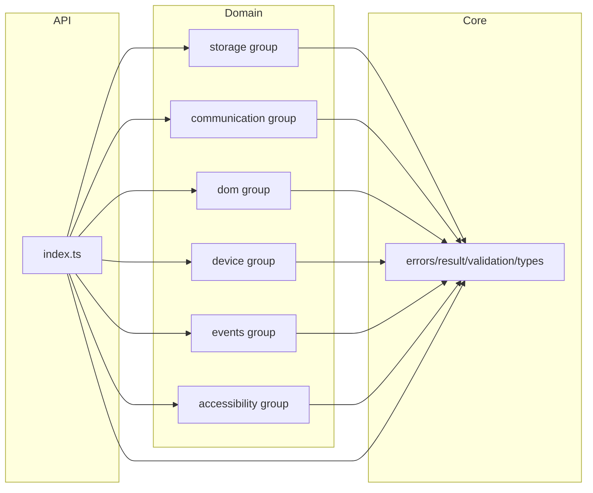

# Architecture

This document describes the module structure and dependency rules for
`@zappzarapp/browser-utils`.

## Table of Contents

- [Layer Overview](#layer-overview)
- [Dependency Graph](#dependency-graph)
- [Import Rules](#import-rules)
- [Module Categories](#module-categories)
- [Zero Circular Dependencies](#zero-circular-dependencies)

---

## Layer Overview

The codebase follows a three-layer architecture:

```text
+----------------------------------------------------------+
|                     Public API Layer                      |
|                      (src/index.ts)                       |
|              Re-exports from all domain modules           |
+----------------------------------------------------------+
                              |
                              v
+----------------------------------------------------------+
|                      Domain Layer                         |
|        (29 independent modules with focused concerns)     |
|   storage, session, cookie, clipboard, url, a11y, ...     |
+----------------------------------------------------------+
                              |
                              v
+----------------------------------------------------------+
|                       Core Layer                          |
|                (Foundation utilities)                     |
|      errors | result | validation | types                 |
+----------------------------------------------------------+
```

### Layer Responsibilities

| Layer      | Purpose                             | Imports From   |
| ---------- | ----------------------------------- | -------------- |
| Public API | Unified entry point, barrel exports | Domain, Core   |
| Domain     | Feature implementations             | Core only\*    |
| Core       | Types, errors, validation, Result   | Nothing (leaf) |

\*No cross-domain exceptions. `storage` uses `LoggerLike` from `core`, and
`scroll` uses `debounce`/`throttle` from `core`.

---

## Dependency Graph

```mermaid
graph TD
    subgraph Core["Core Layer (Foundation)"]
        types["types"]
        errors["errors"]
        result["result"]
        validation["validation"]
    end

    subgraph Domain["Domain Layer (Features)"]
        subgraph Storage["Storage Modules"]
            storage["storage"]
            session["session"]
            cookie["cookie"]
            indexeddb["indexeddb"]
        end

        subgraph Communication["Communication Modules"]
            clipboard["clipboard"]
            broadcast["broadcast"]
            websocket["websocket"]
            notification["notification"]
            network["network"]
        end

        subgraph URL["URL & Navigation"]
            url["url"]
        end

        subgraph Events["Event Handling"]
            events["events"]
            keyboard["keyboard"]
            focus["focus"]
        end

        subgraph DOM["DOM Utilities"]
            html["html"]
            sanitize["sanitize"]
            form["form"]
            scroll["scroll"]
            fullscreen["fullscreen"]
        end

        subgraph Observers["Observer Patterns"]
            observe["observe"]
            idle["idle"]
            visibility["visibility"]
        end

        subgraph Device["Device & System"]
            device["device"]
            features["features"]
            media["media"]
            performance["performance"]
            geolocation["geolocation"]
        end

        subgraph Security["Security"]
            csp["csp"]
        end

        subgraph Diagnostics["Diagnostics"]
            logging["logging"]
            download["download"]
        end

        subgraph Accessibility["Accessibility"]
            a11y["a11y"]
        end
    end

    subgraph PublicAPI["Public API Layer"]
        index["index.ts"]
    end

    %% Core internal dependencies
    errors --> types
    result --> types
    validation --> types

    %% Domain to Core dependencies
    storage --> errors
    storage --> result
    storage --> validation
    storage --> types

    session --> errors

    cookie --> errors
    cookie --> result
    cookie --> validation

    indexeddb --> errors
    indexeddb --> result
    indexeddb --> types

    clipboard --> errors
    clipboard --> result
    clipboard --> validation

    broadcast --> errors
    broadcast --> types

    websocket --> errors
    websocket --> types

    notification --> errors
    notification --> result
    notification --> types

    network --> errors
    network --> types

    url --> errors
    url --> result
    url --> validation
    url --> types

    events --> types

    keyboard --> types

    focus --> types

    html

    sanitize --> types

    form --> types

    scroll --> types
    scroll --> types

    fullscreen --> errors
    fullscreen --> result
    fullscreen --> types

    observe --> types

    idle --> types

    visibility --> types

    device --> types

    features

    media --> types

    performance --> types

    geolocation --> errors
    geolocation --> result
    geolocation --> types

    csp

    logging

    download --> validation

    a11y --> errors
    a11y --> types

    %% Public API aggregates all
    index --> storage
    index --> session
    index --> cookie
    index --> indexeddb
    index --> clipboard
    index --> broadcast
    index --> websocket
    index --> notification
    index --> network
    index --> url
    index --> events
    index --> keyboard
    index --> focus
    index --> html
    index --> sanitize
    index --> form
    index --> scroll
    index --> fullscreen
    index --> observe
    index --> idle
    index --> visibility
    index --> device
    index --> features
    index --> media
    index --> performance
    index --> geolocation
    index --> csp
    index --> logging
    index --> download
    index --> a11y
    index --> errors
    index --> result
    index --> validation
    index --> types
```



### Simplified View



---

## Import Rules

### Core Layer

```typescript
// ALLOWED: Core modules have no external dependencies
import type { CleanupFn } from './types';

// NOT ALLOWED: Never import from domain modules
// import { Logger } from '../logging';  // FORBIDDEN
```

### Domain Layer

```typescript
// ALLOWED: Import from core
import { Result, ValidationError, Validator } from '../core';
import type { CleanupFn } from '../core/types';

// ALLOWED: Import from same module (internal)
import { StorageConfig } from './StorageConfig';

// NOT ALLOWED: Cross-domain imports
// import { Logger } from '../logging';  // FORBIDDEN
// import { debounce } from '../events';  // FORBIDDEN (use core)

// NOT ALLOWED: Import from public API
// import { StorageManager } from '../index';  // FORBIDDEN
```

### Public API Layer

```typescript
// ALLOWED: Re-export from any module
export { StorageManager } from './storage/index.js';
export { Logger } from './logging/index.js';
export type { CleanupFn } from './core/types.js';

// NOT ALLOWED: Implementation code
// const x = new StorageManager();  // FORBIDDEN in index.ts
```

### Import Summary

| From / To  | Core | Domain | Public API |
| ---------- | ---- | ------ | ---------- |
| Core       | Yes  | No     | No         |
| Domain     | Yes  | No     | No         |
| Public API | Yes  | Yes    | -          |

---

## Module Categories

### Core Layer (7 submodules)

Foundation utilities that all domain modules depend on.

| Module     | Path                   | Purpose                                 |
| ---------- | ---------------------- | --------------------------------------- |
| types      | `src/core/types.ts`    | Shared type definitions (CleanupFn)     |
| errors     | `src/core/errors/`     | Error class hierarchy                   |
| result     | `src/core/result/`     | Result<T,E> for explicit error handling |
| validation | `src/core/validation/` | Input validation utilities              |
| logger     | `src/core/logger.ts`   | LoggerLike interface, noopLogger        |
| debounce   | `src/core/Debounce.ts` | Debounce utility (pure function)        |
| throttle   | `src/core/Throttle.ts` | Throttle utility (pure function)        |

### Storage Group (4 modules)

Data persistence across different storage mechanisms.

| Module    | Path             | Purpose                            | Dependencies |
| --------- | ---------------- | ---------------------------------- | ------------ |
| storage   | `src/storage/`   | localStorage with LRU eviction     | core         |
| session   | `src/session/`   | sessionStorage management          | core         |
| cookie    | `src/cookie/`    | Cookie management, secure defaults | core         |
| indexeddb | `src/indexeddb/` | IndexedDB wrapper for large data   | core         |

### Communication Group (5 modules)

APIs for communication and data transfer.

| Module       | Path                | Purpose                       | Dependencies |
| ------------ | ------------------- | ----------------------------- | ------------ |
| clipboard    | `src/clipboard/`    | Clipboard API with fallback   | core         |
| broadcast    | `src/broadcast/`    | BroadcastChannel API wrapper  | core         |
| websocket    | `src/websocket/`    | WebSocket with auto-reconnect | core         |
| notification | `src/notification/` | Browser notification API      | core         |
| network      | `src/network/`      | Network status, retry queue   | core         |

### URL & Navigation (1 module)

URL manipulation and browser history.

| Module | Path       | Purpose                            | Dependencies |
| ------ | ---------- | ---------------------------------- | ------------ |
| url    | `src/url/` | URL builder, query params, history | core         |

### Event Handling Group (3 modules)

Event processing and user interaction.

| Module   | Path            | Purpose                                                   | Dependencies |
| -------- | --------------- | --------------------------------------------------------- | ------------ |
| events   | `src/events/`   | event delegation (re-exports debounce/throttle from core) | core         |
| keyboard | `src/keyboard/` | Keyboard shortcut manager                                 | core         |
| focus    | `src/focus/`    | Focus trap, focusable elements                            | core         |

### DOM Utilities Group (5 modules)

DOM manipulation and visual effects.

| Module     | Path              | Purpose                        | Dependencies |
| ---------- | ----------------- | ------------------------------ | ------------ |
| html       | `src/html/`       | HTML escaping, DOM helpers     | none         |
| sanitize   | `src/sanitize/`   | HTML sanitization              | core         |
| form       | `src/form/`       | Form serialization, validation | core         |
| scroll     | `src/scroll/`     | Scroll utilities               | core         |
| fullscreen | `src/fullscreen/` | Fullscreen API wrapper         | core         |

### Observer Patterns Group (3 modules)

Browser observer APIs.

| Module     | Path              | Purpose                                | Dependencies |
| ---------- | ----------------- | -------------------------------------- | ------------ |
| observe    | `src/observe/`    | Intersection/Resize/Mutation observers | core         |
| idle       | `src/idle/`       | requestIdleCallback utilities          | core         |
| visibility | `src/visibility/` | Page visibility API                    | core         |

### Device & System Group (6 modules)

Device capabilities and system information.

| Module      | Path               | Purpose                    | Dependencies |
| ----------- | ------------------ | -------------------------- | ------------ |
| device      | `src/device/`      | Device/browser detection   | core         |
| features    | `src/features/`    | Browser feature detection  | none         |
| media       | `src/media/`       | Media queries, breakpoints | core         |
| performance | `src/performance/` | Performance monitoring     | core         |
| geolocation | `src/geolocation/` | Geolocation API wrapper    | core         |

### Security Group (1 module)

Security-related utilities.

| Module | Path       | Purpose                      | Dependencies |
| ------ | ---------- | ---------------------------- | ------------ |
| csp    | `src/csp/` | CSP-aware security utilities | none         |

### Diagnostics Group (2 modules)

Logging and file operations.

| Module   | Path            | Purpose                     | Dependencies |
| -------- | --------------- | --------------------------- | ------------ |
| logging  | `src/logging/`  | Console logging with levels | none         |
| download | `src/download/` | File download utilities     | core         |

### Accessibility Group (1 module)

Accessibility utilities for ARIA management and user preferences.

| Module | Path        | Purpose                                           | Dependencies |
| ------ | ----------- | ------------------------------------------------- | ------------ |
| a11y   | `src/a11y/` | AriaUtils, LiveAnnouncer, ReducedMotion, SkipLink | core         |

---

## Zero Circular Dependencies

This codebase enforces **zero circular dependencies** through architectural
constraints:

### Enforcement Mechanisms

1. **TypeScript Build**: Circular dependencies cause compilation failures
2. **Layer Rules**: Dependencies only flow downward (Domain -> Core)
3. **Code Review**: Imports are verified during review

### Verification

```bash
# TypeScript build catches circular dependencies
pnpm run build

# Optional: Use madge for visualization
npx madge --circular src/
```

### Why It Matters

| Problem             | Impact                             |
| ------------------- | ---------------------------------- |
| Circular imports    | Module initialization failures     |
| Deep coupling       | Hard to test, refactor, or replace |
| Hidden dependencies | Unexpected side effects            |

### Resolution Pattern

If you need functionality from another domain module:

```typescript
// WRONG: Direct cross-domain import creating cycle
import { Logger } from '../logging'; // in storage module

// RIGHT: Accept as parameter (dependency injection)
interface StorageOptions {
  logger?: (msg: string) => void;
}

// RIGHT: Extract shared code to core
// Move common functionality to core/shared
```

---

## Module Count Summary

| Category         | Count  | Modules                                                |
| ---------------- | ------ | ------------------------------------------------------ |
| Core             | 4      | types, errors, result, validation                      |
| Storage          | 4      | storage, session, cookie, indexeddb                    |
| Communication    | 5      | clipboard, broadcast, websocket, notification, network |
| URL & Navigation | 1      | url                                                    |
| Event Handling   | 3      | events, keyboard, focus                                |
| DOM Utilities    | 5      | html, sanitize, form, scroll, fullscreen               |
| Observers        | 3      | observe, idle, visibility                              |
| Device & System  | 5      | device, features, media, performance, geolocation      |
| Security         | 1      | csp                                                    |
| Diagnostics      | 2      | logging, download                                      |
| Accessibility    | 1      | a11y                                                   |
| **Total**        | **33** | (including 4 core submodules)                          |
